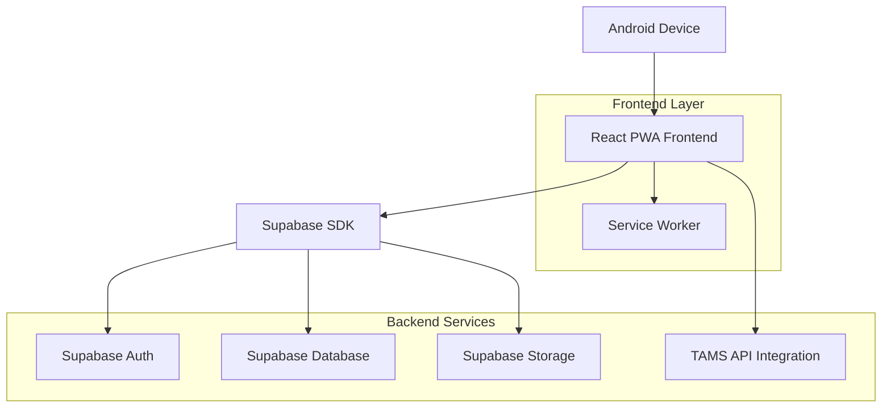
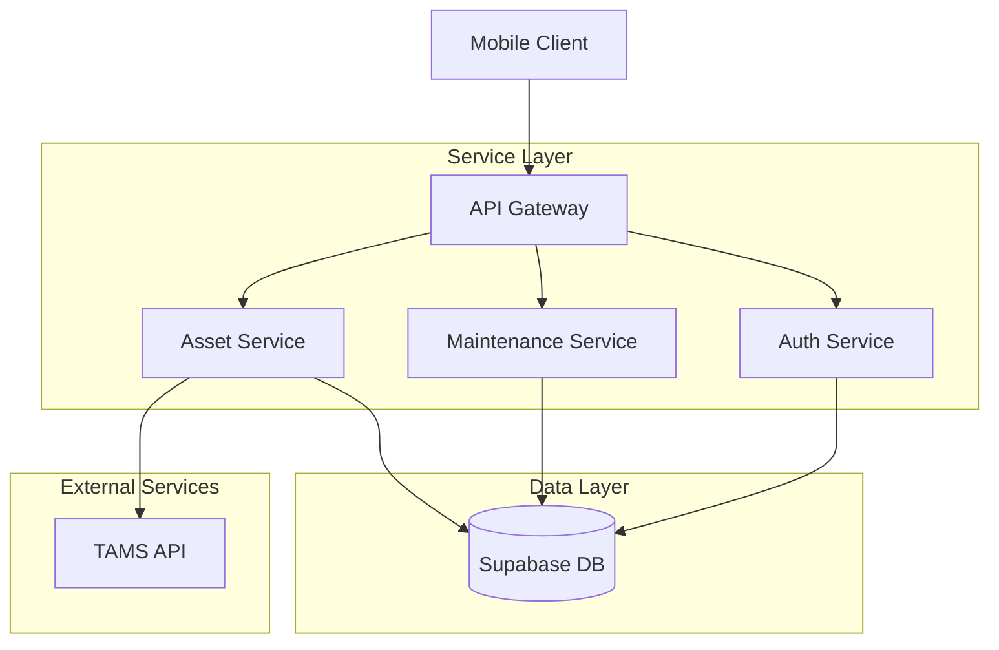
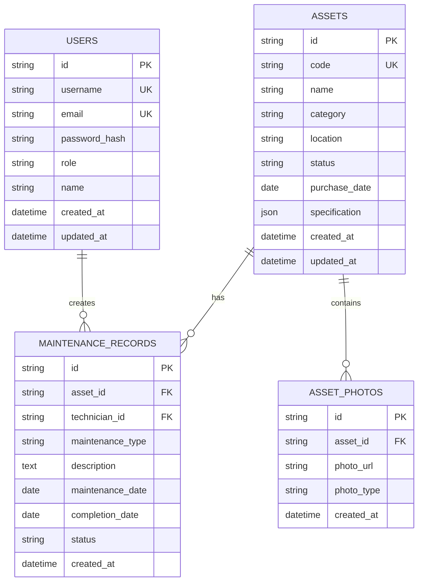

## 1. Architecture design



## 2. Technology Description
- Frontend: React@18 + Vite + PWA
- UI Framework: Material-UI@5 + TailwindCSS@3
- State Management: React Context + useReducer
- Database: Supabase (PostgreSQL)
- Authentication: Supabase Auth
- Storage: Supabase Storage untuk foto maintenance
- Barcode Scanner: QuaggaJS + HTML5 Camera API
- API Integration: Axios untuk TAMS API
- Offline Support: Service Worker + IndexedDB
- Initialization Tool: vite-init

## 3. Route definitions
| Route | Purpose |
|-------|---------|
| /login | Halaman login untuk autentikasi pengguna |
| /dashboard | Halaman utama dengan quick actions dan overview |
| /asset/:id | Detail informasi aset tertentu |
| /asset/:id/history | Riwayat maintenance untuk aset tertentu |
| /maintenance/new/:assetId | Form input maintenance baru |
| /scan | Halaman scanner barcode |
| /profile | Profil pengguna dan settings |

## 4. API definitions

### 4.1 Authentication APIs
```
POST /api/auth/login
```

Request:
| Param Name | Param Type | isRequired | Description |
|------------|------------|-------------|-------------|
| username | string | true | Username atau email pengguna |
| password | string | true | Password pengguna |

Response:
| Param Name | Param Type | Description |
|------------|------------|-------------|
| token | string | JWT token untuk autentikasi |
| user | object | Data user yang login |
| role | string | Role user (teknisi/supervisor) |

### 4.2 Asset APIs
```
GET /api/assets/:id
```

Response:
| Param Name | Param Type | Description |
|------------|------------|-------------|
| id | string | Unique identifier aset |
| code | string | Kode aset |
| name | string | Nama aset |
| location | string | Lokasi aset |
| category | string | Kategori aset |
| status | string | Status kondisi aset |
| purchase_date | date | Tanggal pembelian |
| specification | object | Detail spesifikasi teknis |

### 4.3 Maintenance APIs
```
POST /api/maintenance
```

Request:
| Param Name | Param Type | isRequired | Description |
|------------|------------|-------------|-------------|
| asset_id | string | true | ID aset yang dimaintenance |
| maintenance_type | string | true | Jenis maintenance (preventive/corrective) |
| description | string | true | Deskripsi masalah/tindakan |
| technician_id | string | true | ID teknisi yang handle |
| photos | array | false | Array foto before/after |
| completion_date | date | true | Tanggal selesai maintenance |

## 5. Server architecture diagram



## 6. Data model

### 6.1 Data model definition


### 6.2 Data Definition Language

**Users Table**
```sql
CREATE TABLE users (
    id UUID PRIMARY KEY DEFAULT gen_random_uuid(),
    username VARCHAR(50) UNIQUE NOT NULL,
    email VARCHAR(255) UNIQUE NOT NULL,
    password_hash VARCHAR(255) NOT NULL,
    role VARCHAR(20) NOT NULL CHECK (role IN ('teknisi', 'supervisor', 'admin')),
    name VARCHAR(100) NOT NULL,
    created_at TIMESTAMP WITH TIME ZONE DEFAULT NOW(),
    updated_at TIMESTAMP WITH TIME ZONE DEFAULT NOW()
);

-- Indexes
CREATE INDEX idx_users_username ON users(username);
CREATE INDEX idx_users_role ON users(role);
```

**Assets Table**
```sql
CREATE TABLE assets (
    id UUID PRIMARY KEY DEFAULT gen_random_uuid(),
    code VARCHAR(50) UNIQUE NOT NULL,
    name VARCHAR(255) NOT NULL,
    category VARCHAR(100) NOT NULL,
    location VARCHAR(255) NOT NULL,
    status VARCHAR(50) NOT NULL DEFAULT 'active',
    purchase_date DATE,
    specification JSONB,
    created_at TIMESTAMP WITH TIME ZONE DEFAULT NOW(),
    updated_at TIMESTAMP WITH TIME ZONE DEFAULT NOW()
);

-- Indexes
CREATE INDEX idx_assets_code ON assets(code);
CREATE INDEX idx_assets_category ON assets(category);
CREATE INDEX idx_assets_status ON assets(status);
```

**Maintenance Records Table**
```sql
CREATE TABLE maintenance_records (
    id UUID PRIMARY KEY DEFAULT gen_random_uuid(),
    asset_id UUID REFERENCES assets(id) ON DELETE CASCADE,
    technician_id UUID REFERENCES users(id) ON DELETE SET NULL,
    maintenance_type VARCHAR(50) NOT NULL CHECK (maintenance_type IN ('preventive', 'corrective')),
    description TEXT NOT NULL,
    maintenance_date DATE NOT NULL,
    completion_date DATE,
    status VARCHAR(50) NOT NULL DEFAULT 'pending',
    created_at TIMESTAMP WITH TIME ZONE DEFAULT NOW(),
    updated_at TIMESTAMP WITH TIME ZONE DEFAULT NOW()
);

-- Indexes
CREATE INDEX idx_maintenance_asset_id ON maintenance_records(asset_id);
CREATE INDEX idx_maintenance_technician_id ON maintenance_records(technician_id);
CREATE INDEX idx_maintenance_date ON maintenance_records(maintenance_date);
```

**Supabase Row Level Security (RLS) Policies**
```sql
-- Enable RLS
ALTER TABLE maintenance_records ENABLE ROW LEVEL SECURITY;

-- Policies untuk authenticated users
CREATE POLICY "Users can view all maintenance records" ON maintenance_records
    FOR SELECT USING (auth.role() = 'authenticated');

CREATE POLICY "Users can insert their own maintenance records" ON maintenance_records
    FOR INSERT WITH CHECK (auth.uid() = technician_id);

CREATE POLICY "Users can update their own maintenance records" ON maintenance_records
    FOR UPDATE USING (auth.uid() = technician_id);
```

### 6.3 Integration dengan TAMS API
```javascript
// Contoh integrasi API TAMS
const syncAssetFromTAMS = async (assetCode) => {
    const response = await fetch(`${TAMS_API_URL}/assets/${assetCode}`, {
        headers: {
            'Authorization': `Bearer ${TAMS_API_KEY}`,
            'Content-Type': 'application/json'
        }
    });
    
    const assetData = await response.json();
    
    // Simpan ke Supabase
    const { data, error } = await supabase
        .from('assets')
        .upsert({
            code: assetData.code,
            name: assetData.name,
            category: assetData.category,
            location: assetData.location,
            specification: assetData.specification
        });
    
    return { data, error };
};
```