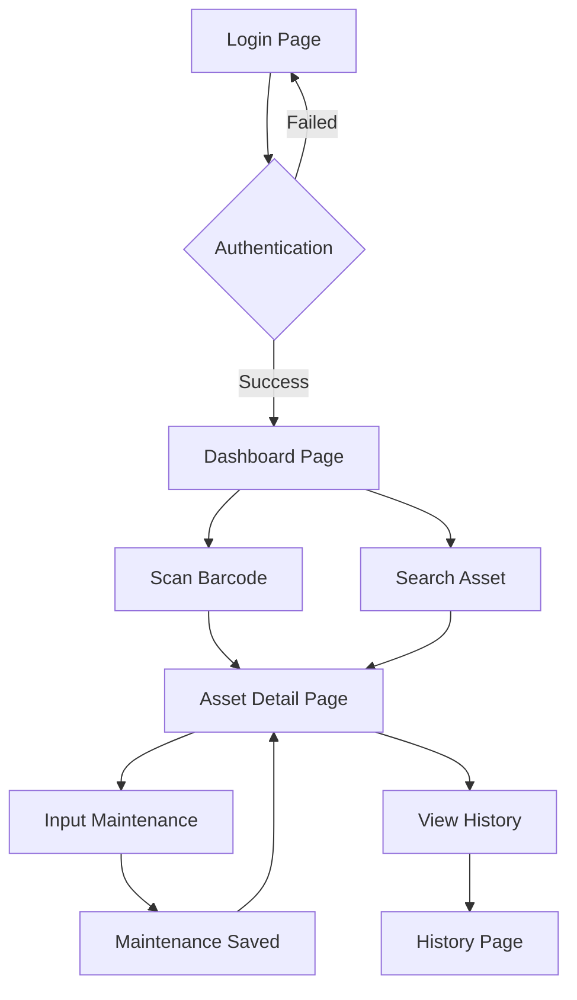

## 1. Product Overview
Aplikasi Maintenance Asset adalah sistem manajemen perawatan aset berbasis mobile yang dirancang untuk membantu perusahaan dalam melacak, memelihara, dan mengelola aset secara efisien. Aplikasi ini memungkinkan teknisi untuk memindai barcode aset, melihat detail aset, mencatat aktivitas maintenance, dan mengakses riwayat perawatan.

Aplikasi ini ditujukan untuk teknisi maintenance dan staf operasional yang membutuhkan akses cepat ke informasi aset dan kemampuan untuk mencatat aktivitas perawatan secara real-time.

## 2. Core Features

### 2.1 User Roles
| Role | Registration Method | Core Permissions |
|------|---------------------|------------------|
| Teknisi Maintenance | Admin assignment | Scan barcode, input maintenance data, view asset details |
| Supervisor | Admin assignment | Full access including approval and reporting |

### 2.2 Feature Module
Aplikasi Maintenance Asset terdiri dari halaman-halaman utama berikut:
1. **Login Page**: Autentikasi pengguna, validasi kredensial.
2. **Dashboard Page**: Navigasi utama, quick access scan barcode, daftar aset terbaru.
3. **Asset Detail Page**: Informasi lengkap aset, spesifikasi teknis, status kondisi.
4. **History Maintenance Page**: Riwayat perawatan lengkap, filter by date, export data.
5. **Input Maintenance Page**: Form input data perawatan, upload foto, pilih jenis maintenance.

### 2.3 Page Details
| Page Name | Module Name | Feature description |
|-----------|-------------|---------------------|
| Login Page | User Authentication | Validasi username dan password, session management, remember me option |
| Dashboard Page | Quick Navigation | Tombol scan barcode cepat, search asset by name/code, daftar 5 aset terakhir |
| Asset Detail Page | Asset Information | Tampilkan nama aset, kode, lokasi, kategori, status kondisi, tanggal pembelian |
| Asset Detail Page | Technical Specification | Detail spesifikasi teknis, manual book, gambar aset |
| History Maintenance Page | Maintenance Log | Tampilkan list riwayat perawatan dengan tanggal, jenis, dan status |
| History Maintenance Page | Filter & Search | Filter by date range, jenis maintenance, teknisi yang handle |
| Input Maintenance Page | Maintenance Form | Input tanggal, jenis perawatan, deskripsi masalah, tindakan yang dilakukan |
| Input Maintenance Page | Photo Documentation | Upload foto before/after perawatan, kompresi otomatis |
| Barcode Scanner | Camera Integration | Aktifkan kamera untuk scan barcode/QR code, auto-focus |
| API Integration | TAMS Connection | Ambil data aset dari API TAMS, sinkronisasi otomatis |

## 3. Core Process
### User Flow Utama:
1. User login dengan kredensial yang valid
2. Masuk ke dashboard utama dengan pilihan scan barcode atau search manual
3. Setelah scan/selection, tampil detail asset
4. Dari detail asset, user bisa:
   - Klik "Input Maintenance" untuk mencatat perawatan baru
   - Klik "View History" untuk melihat riwayat perawatan
5. Pada halaman input maintenance, user mengisi form dan submit
6. Data tersimpan dan update status asset otomatis

### Admin Flow:
1. Login dengan role admin
2. Akses menu admin untuk manage users dan settings
3. Monitor dashboard untuk overview seluruh asset

## 4. User Interface Design

### 4.1 Design Style
- **Primary Color**: Biru profesional (#2563EB)
- **Secondary Color**: Abu-abu terang (#F3F4F6)
- **Button Style**: Rounded corners dengan shadow subtle
- **Font**: Inter/SF Pro Display - clean dan modern
- **Layout**: Card-based design dengan proper spacing
- **Icons**: Material Design Icons untuk konsistensi

### 4.2 Page Design Overview
| Page Name | Module Name | UI Elements |
|-----------|-------------|-------------|
| Login Page | Authentication Form | Logo perusahaah di atas, input fields dengan icons, tombol login besar, link forgot password |
| Dashboard Page | Navigation Grid | 2x2 grid card untuk quick actions, search bar di atas, list asset dengan card horizontal |
| Asset Detail Page | Information Display | Header dengan nama asset, tab untuk detail/spesifikasi/history, action button di bawah |
| History Maintenance Page | Data Table | Table responsive dengan column tanggal, jenis, status, teknisi, action button di kanan |
| Input Maintenance Page | Form Layout | Form bertingkat dengan step indicator, photo upload dengan preview, submit button sticky |

### 4.3 Responsiveness
Mobile-first design approach dengan breakpoint:
- Mobile: 320px - 768px (prioritas utama)
- Tablet: 768px - 1024px
- Desktop: 1024px+ (untuk versi web)

Touch interaction optimization dengan:
- Touch target minimum 44px
- Swipe gesture untuk navigation
- Pull-to-refresh untuk data update

### 4.4 Performance Optimization
- Lazy loading untuk images
- Offline mode dengan service worker
- Cache strategi untuk API calls
- Skeleton loading untuk better UX